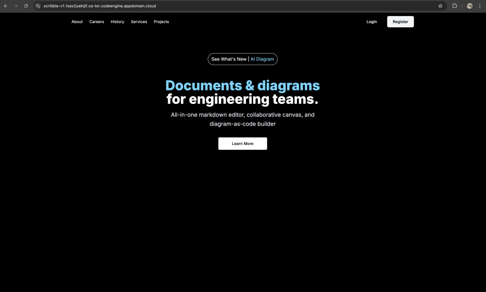
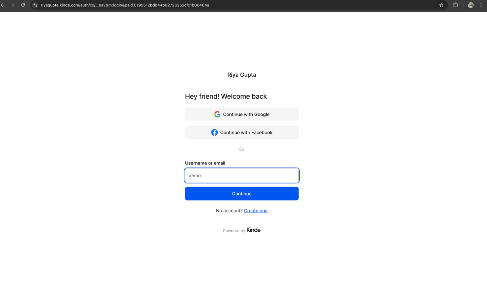
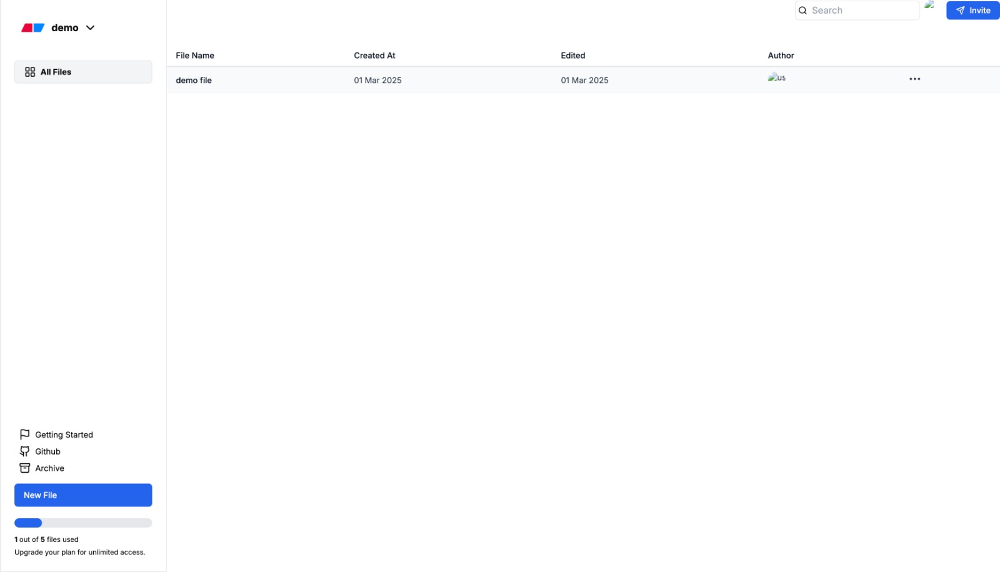
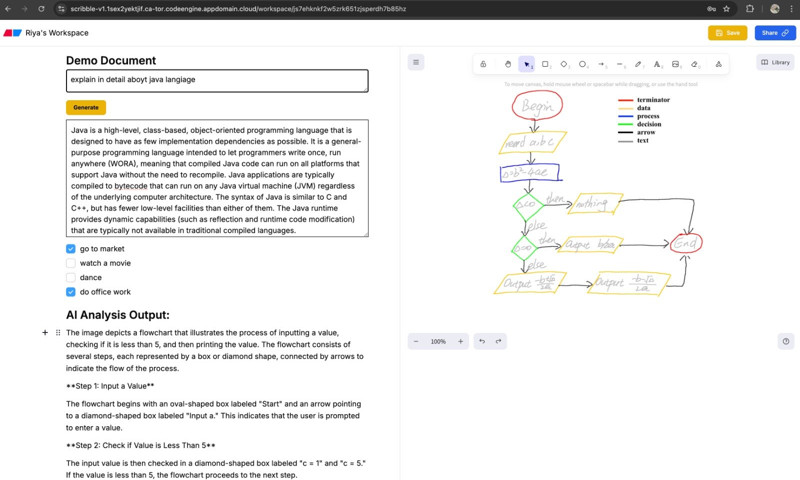

# Scribble

## Overview

This **Next.js** application is an AI-powered productivity tool that integrates **Watsonx.ai** agents to enhance content generation, grammar correction, and visual analysis. It enables users to create and manage structured documents while also allowing AI-assisted sketching and image analysis in an interactive canvas.

The project is built with Kinde for authentication, **Convex for real-time database storage**, and leverages **middleware for authentication and authorization**. Additionally, it supports **containerized deployment using Podman** for efficient scalability.

## 🎯 Features

- 🔐 **User Authentication** with Kinde
- 🔄 Middleware for authentication and authorization
- 📦 **Database Management** using Convex
- ✍️ Text-based AI Operations (Text Generation & English Correction)
- 🎨 Canvas-based AI Analysis (Drawing & Image Processing)
- 🧠 **AI-powered Features** using Watsonx.ai
- ⚡ **Fast and Scalable** Next.js architecture
- 🛠️ **Dockerization with Podman**

## AI Features

This application integrates three AI-driven functionalities:

1. **Text Generation**

   - Generate descriptions for technical topics.
   - Write emails, messages, and formal communication.
   - Uses **Prompt Templates from Watsonx Studio** for structured output.

2. **English Correction**

   - Checks and corrects grammar, spelling, and punctuation errors.
   - Uses **Prompt Templates from Watsonx Studio** for accuracy.

3. **Canvas AI Analysis**

   - Users can **draw or import images** in the canvas.
   - The AI agent from **Watsonx Studio** analyzes the drawing or image and provides a description.
   - Users can export images locally.

## File Management & Editor

- After login, users can **create folders** and manage files inside them.
- Each file consists of two parts:
  - **Editor**: Supports text-related AI operations (Text Generation & English Correction) and standard documentation features (headers, project details, lists, checklists, quotes).
  - **Canvas**: Supports drawing with a **custom menu for drawing tools and pre-built shapes** to enhance the user experience. The AI agent from Watsonx Studio analyzes drawings in real-time.

## Installation

### Prerequisites

Ensure you have the following installed:

- Node.js (>= 16.0.0)
- Yarn or npm
- Podman (for containerization)

## 📌 Setup 

### 1️⃣ Clone the Repository  
   ```bash
   git clone https://github.ibm.com/Riya-Gupta3010/Scribble.git
   ```
### 2️⃣Navigate to the project folder:
   ```bash
   cd Scribble
   ```
### 3️⃣ Install Dependencies  
   ```bash
   npm install
   # or
   yarn install
   ```
## 📌 Environment Variables  
   - Create a `.env.local` file in the root directory.
   - Add the required API keys and credentials.
   ```env
   NEXT_PUBLIC_KINDE_DOMAIN=your-kinde-domain
   NEXT_PUBLIC_CONVEX_URL=your-convex-url
   NEXT_PUBLIC_GENERATE_TEXT_API=your-api-key
   KINDE_CLIENT_ID=your-kinde-client-id
   KINDE_CLIENT_SECRET=your kinde-secret-key
   KINDE_ISSUER_URL=your-kinde-url
   KINDE_SITE_URL=http://localhost:3000
   KINDE_POST_LOGOUT_REDIRECT_URL=http://localhost:3000
   KINDE_POST_LOGIN_REDIRECT_URL=http://localhost:3000/dashboard
   CONVEX_DEPLOYMENT=dev:glad-fish-700 
   NEXT_PUBLIC_GENERATE_ENGLISH_API=your-api-key
   ```
## 🚀 Running the Application 
   ```bash
   npm run dev
   # or
   yarn dev
   ```

## 📦 Dockerization

This project is containerized using **Podman**.

### Before You Start
Ensure that you add the required **environment variable values** and **credentials** in the Dockerfile before building the container. This is necessary for a proper build of the Next.js app.

1. Build the container:
   ```bash
   podman build --arch amd64 -t "scribble:v1" .
   ```
2. Run the container:
   ```bash
   podman run -p 3000:3000 scribble:v1
   ```

## 🎯 Usage 

1. **Sign up / Login** using Kinde authentication.
2. **Create folders and files** inside the system.
3. **Use the Editor** for text-based AI operations and documentation.
4. **Use the Canvas** for drawing and AI-powered analysis.
5. **Export images** locally.

## 🚀 Deployment 

To deploy the project:

```bash
npm run build
npm start
```

For **Vercel**, simply push to GitHub and connect the repository in the Vercel dashboard.
## Screenshots
- **Landing Page**

- **Login Page**

- **Dashboard**

- **Document Editor & Canvas**


## 👥 Contributing  
Contributions are welcome! To contribute:
1️⃣ **Fork** this repository.
2️⃣ **Create a feature branch** (`git checkout -b feature-name`).
3️⃣ **Commit your changes** (`git commit -m "Add new feature"`).
4️⃣ **Push to the branch** (`git push origin feature-name`).
5️⃣ **Open a Pull Request**.


## 📜 License  
This project is open for modification and use according to your needs.
